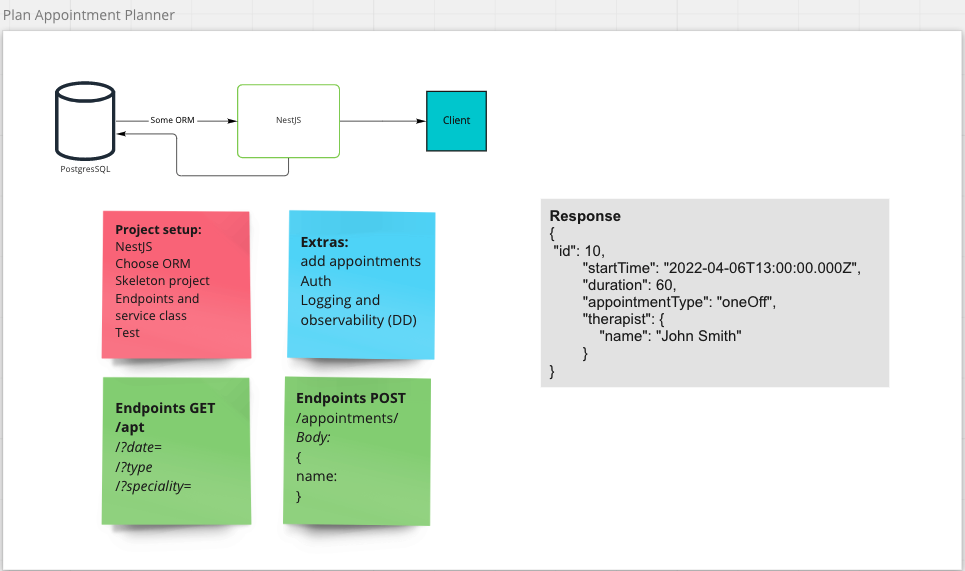
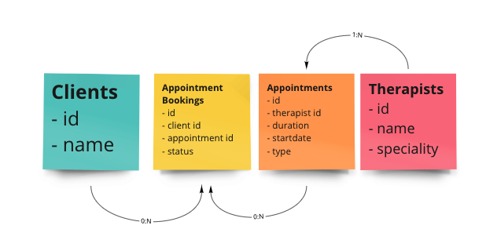

# Appointment App

## Description
An appointment application that allows you to retreive appointments based on filtering the criteria below and also add new appointment slots.
- Date ranges
- Appointment type
- Therapist speciality

### Stack
- NestJS
- Typescript
- PostgresSQL
- TypeORM

I found the docs of the respective tools to be really useful. There was a fair bit of learning to do before I could get down to fleshing out the solution :)

## Initial design
To emulate real life I started off sketching up a plan for the project and gathering requirements. This resulted in a Miro board of ideas:





### API
From the above plan I created 2 endpoints:
- `GET appointments/?startDate={}&endDate={}&appointmentType={}&specialisms={}`
- `POST appointments` 
- 
Sample Body:
```
{
    "therapistId": 2,
    "startTime":"2022-04-06T13:00:00Z",
    "endTime":"2022-04-06T14:00:00Z",
    "appointmentType": "oneOff"
}
```

## Learnings/Observations
- **ORM choice:** TypeORM seemed very widely used and had good docs
- **Modules:** Used built in NestJS modules as they provide all the boiler plate needed for setting up a serivce and allow for quick and easy extension of the project
- **DB Migrations:** Would have prefered to bootstrap the DB on startup as migrations are stateful but couldn't figure out how
- **Intercaptors:** Really enjoyed using these. I didn't create a custom transformation and instead used the built in `ClassSerializerInterceptor` to expose the data I needed in the response from the DB. I would have done this very differently in .NET, by creating a mapper and models classes and parsing the JSON on response.
- **Error Handling:** I used the `class-validator` library to decorate the DTO fields which returnd a `400` status code if the parameters were the wrong type or value in the case of the Enums. This was also pretty different to .NET where I would usually handle `BadRequest` at the controller level. 

## Installation

```bash
$ npm install
```

## Running the app

```bash
# development
$ npm run start

# watch mode
$ npm run start:dev

# production mode
$ npm run start:prod
```

## Test

```bash
# unit tests
$ npm run test

# e2e tests
$ npm run test:e2e

# test coverage
$ npm run test:cov
```

- Author - [Kamil Myśliwiec](https://kamilmysliwiec.com)
- Website - [https://nestjs.com](https://nestjs.com/)
- Twitter - [@nestframework](https://twitter.com/nestframework)

## License

Nest is [MIT licensed](LICENSE).
